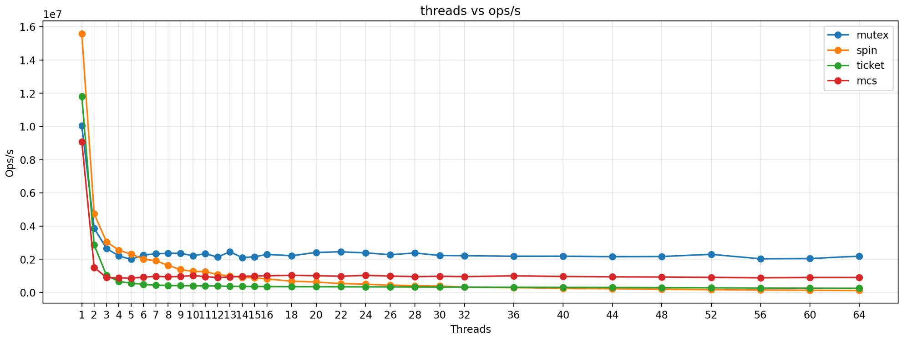

# lock_test

一个用于比较不同锁在多线程下吞吐量（Ops/s）的精简 C++17 基准工具。通过固定时长运行，统计“每轮：锁外并行 + 锁内临界区”的完成次数。

支持的锁：mutex（std::mutex）、spin（TAS）、ticket、mcs。
支持的任务：do_nothing、cpu_burn（大部分在锁外，少部分在锁内）。

## 构建

```fish
mkdir -p build
cmake -S . -B build -DCMAKE_BUILD_TYPE=Release
cmake --build build -j
```

可执行文件：`build/lock_test`

## 最快上手

- 单次运行（默认线程集：1,2,4,8,16,32）
```fish
./build/lock_test -r cpu_burn -l mutex -d 1.0 -R 2048:32
```

- 自定义线程粒度（分段区间）+ 一次对比多锁 + 直接输出 CSV
```fish
./build/lock_test -r cpu_burn -L mutex,spin,ticket,mcs \
  -B 1-64:1,65-128:8 -n 5 -d 1.0 -R 2048:32 \
  --csv-file results.csv --csv-only
```

- 用脚本从 CSV 绘图（避免反复启动二进制）
```fish
python3 tools/plot_locks.py --csv-in results.csv --output results.png
```

## 常用参数（简表）

- 线程：`-t N` 单点；`-T a,b,c` 列表；`-B 1-64:1,65-128:8` 分段区间（闭区间，步长默认 1）。
- 锁与任务：`-l lock` 单锁；`-L a,b,c` 多锁；`-r task` 任务类型。
- 负载：`-R p[:l]`（cpu_burn 并行/加锁迭代，默认 2048:32）。
- 时长与重复：`-d 秒`（默认 2.0）、`-n 次`（默认 5）。
- CSV：`--csv` 输出到 stdout；`--csv-only` 仅 CSV；`--csv-file path` 写文件。

## 示例结果（仅示意）

 
 

## 目录与扩展

- include/：`iLock.h`、`iRunTask.h`（两阶段：run_parallel / run_locked），以及锁实现；
- src/：`main.cpp`（CLI 与批量 sweep/CSV）、`lockTestSys.*`（多线程固定时长执行）；
- tools/：`plot_locks.py`（从 CSV 绘图，或按需运行并绘图）。

扩展：
- 新锁：继承 `lt::iLock` 并在 `make_lock()` 注册；
- 新任务：继承 `lt::iRunTask` 并在 `make_task()` 注册。

## 小贴士

- 使用 Release 构建，尽量在低干扰环境下测试；短时不稳定可加大 `-d`；需要更平滑可提高 `-n` 取平均。