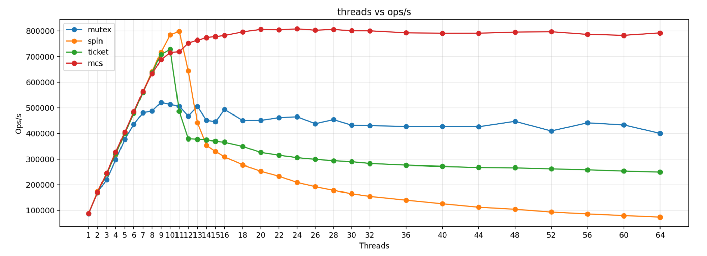

# lock_test

一个用于比较不同锁在多线程下吞吐量（Ops/s）的精简 C++17 基准工具。通过固定时长运行，统计“每轮：锁外并行 + 锁内临界区”的完成次数”。

支持的锁：
- 原版：`mutex`（std::mutex）、`spin`/`tas`（TAS）、`ticket`、`mcs`
- preLoad 变体：`spin_preload`/`tas_preload`、`ticket_preload`、`mcs_preload`
支持的任务：
- cpu_burn：大部分在锁外，少部分在锁内（可用 `-R p[:l]` 配置比例）；
- do_nothing：两阶段均为空操作，用于隔离纯锁开销。

## 构建

```fish
mkdir -p build
cmake -S . -B build -DCMAKE_BUILD_TYPE=Release
cmake --build build -j
```

可执行文件：`build/lock_test`


## 最快上手

- 自定义线程粒度（分段区间）+ 一次对比多锁 + 输出 CSV（推荐工作流）
```fish
./build/lock_test -r cpu_burn -L mutex,spin,ticket,mcs \
  -B 1-64:1,65-128:8 -n 5 -d 1.0 -R 2048:32 \
  --csv-file results.csv --csv-only
```

- 用脚本从 CSV 绘图
```fish
python3 tools/plot_locks.py --csv-in results.csv --output results.png
```

- do_nothing 示例（不使用 -R）
```fish
./build/lock_test -r do_nothing -L mutex,spin -B 1-8:1 -n 3 -d 0.5 \
  --csv-file results_dn.csv --csv-only
```

- preLoad 对比示例（观察优先 vs 原版）
```fish
# TAS: 原版 vs preLoad
./build/lock_test -r do_nothing -L spin,spin_preload -B 1-8:1 -n 2 -d 0.5 \
  --csv-file spin_cmp.csv --csv-only

# Ticket: 原版 vs preLoad
./build/lock_test -r do_nothing -L ticket,ticket_preload -B 1-8:1 -n 2 -d 0.5 \
  --csv-file ticket_cmp.csv --csv-only

# MCS: 原版 vs preLoad
./build/lock_test -r do_nothing -L mcs,mcs_preload -B 1-8:1 -n 2 -d 0.5 \
  --csv-file mcs_cmp.csv --csv-only
```

## 常用参数（简表）

- 任务：`-r task` 任务类型：`cpu_burn` | `do_nothing`（可扩展）。
- 锁：`-L a,b,c` 多锁。
- 线程：`-B 1-64:1,65-128:8` 分段区间（闭区间，步长默认 1）。
- 负载：`-R p[:l]` cpu_burn 并行/加锁迭代，默认 2048:32。
- 时长与重复：`-d 秒`（默认 2.0）、`-n 次`（默认 5）。
- CSV：`--csv-file path` 写文件；`--csv-only` 仅输出 CSV（不打印表格）。

注：旧版单点/线程列表/单锁等参数（如 `-t/-T/-l/--csv`）在当前简化模式下已移除。

## 示例结果（仅示意）




## 目录与扩展

- include/：`iLock.h`、`iRunTask.h`（两阶段：run_parallel / run_locked），以及锁实现；
- src/：`main.cpp`（简化 CLI、批量 sweep、CSV 输出）、`lockTestSys.*`（多线程固定时长执行）；
- tools/：`plot_locks.py`（仅从 CSV 绘图）。

扩展：
- 新锁：继承 `lt::iLock` 并在 `make_lock()` 分支中注册；
- 新任务：继承 `lt::iRunTask` 并在 `make_task()` 工厂内注册（示例：`cpu_burn`、`do_nothing`）。

## 小贴士

- 使用 Release 构建，尽量在低干扰环境下测试；短时不稳定可加大 `-d`；需要更平滑可提高 `-n` 取平均。

## 线程绑核（CPU 亲和性）

- 在 Linux 下，程序会将每个工作线程以“轮转（round-robin）”方式绑定到在线 CPU 上（`pthread_setaffinity_np`）。
- 目的：避免线程在核心之间迁移导致的 TSC/缓存抖动，提升计时稳定性与可重复性。
- 非 Linux 平台不会绑核，按系统调度运行。

## CSV 字段说明

输出列为：

- `task`：任务名（如 `cpu_burn` / `do_nothing`）
- `lock`：锁实现（如 mutex/spin/ticket/mcs 或其 preLoad 变体）
- `threads`：线程数
- `duration`：单次运行时长（秒）
- `repeats`：重复次数（取平均）
- `cpu_parallel_iters` / `cpu_locked_iters`：并行/临界区的迭代次数（`do_nothing` 下为 0）
- `avg_ops`：重复后平均完成轮数
- `ops_s`：吞吐量（avg_ops / duration）

## 关于 preLoad 变体（观察优先）

- 设计动机：在尝试获取锁之前先用共享 load 观察状态；若锁忙则不进行原子写（RMW），避免不必要的 RFO/总线独占代价。
- 实现要点：
  - TAS：`spin_preload`/`tas_preload` 先 `load` 再 `CAS` 上锁；忙时仅观察不写。
  - Ticket：`ticket_preload` 仅在空闲（`serving==next`）时 `CAS` 领取票据；忙时只观察不写。为达成“忙时不写”，牺牲了严格 FIFO 公平性（多个线程可能在空闲瞬间并发 CAS 争抢）。
  - MCS：`mcs_preload` 仅在 `tail==nullptr` 时 `CAS` 占位获取锁；忙时只观察不写。该变体不构建队列，公平性弱于原版 MCS。
- 取舍说明：preLoad 变体旨在对照实验“观察优先、尽量减少忙时写入”的效果，语义/公平性与原版不同，建议与原版一同对比评估。